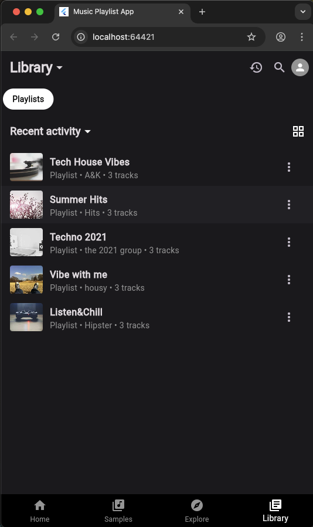
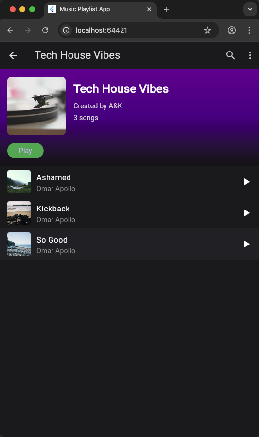
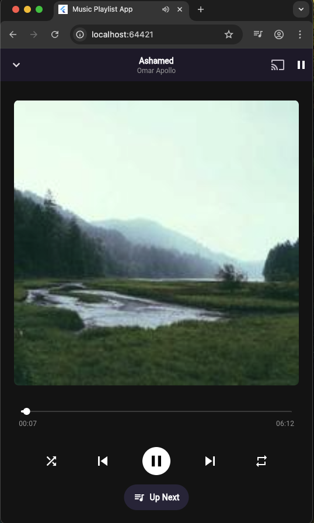
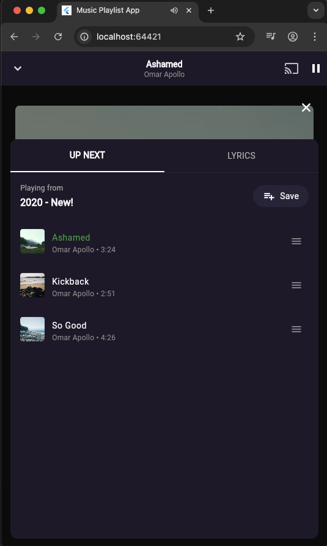

# music_play_list

A new Flutter project.

This project is a starting point for a Flutter application.

** Recommend opening the run project with Chrome (web-javascript) **

*The songs are from an API that allows you to use licensed songs in the app*

  
  
  
  
 
 

